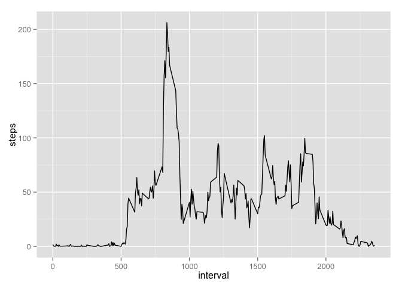
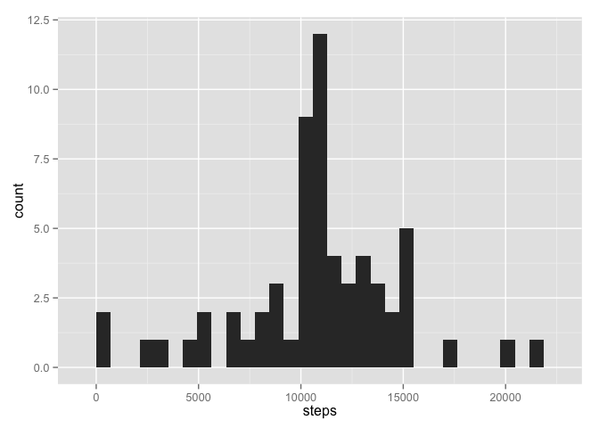
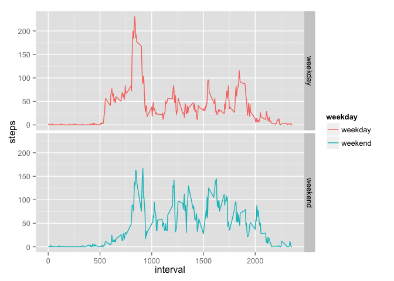

# Reproducible Research: Peer Assessment 1


## Loading and preprocessing the data
Overall, we'll be looking at summary statistics in our activity dataset
First, we'll read in and process the data 


```r
library(ggplot2)
library(dplyr)
```

```
## 
## Attaching package: 'dplyr'
```

```
## The following objects are masked from 'package:stats':
## 
##     filter, lag
```

```
## The following objects are masked from 'package:base':
## 
##     intersect, setdiff, setequal, union
```

```r
#First read it in
act <- read.csv(unzip('activity.zip'))

#Now the dates to date format  
act$date <- as.Date(as.character(act$date))
```


## What is mean total number of steps taken per day?
Now I'll make a histogram of the total number of steps taken each day 


```r
SumOfSteps <- group_by(act, date) %>% summarize( steps = sum(steps, na.rm = TRUE))
qplot(steps, data = SumOfSteps)
```

```
## stat_bin: binwidth defaulted to range/30. Use 'binwidth = x' to adjust this.
```

\

Let's answer the question of what is the mean total number of steps taken per day?

```r
mean(SumOfSteps$steps, na.rm = TRUE)
```

```
## [1] 9354.23
```

How about the median?]

```r
median(SumOfSteps$steps)
```

```
## [1] 10395
```


## What is the average daily activity pattern?
What does a typical day look like? 

```r
#Time series plot of the average number of steps taken  
AvgActivityPattern <- group_by(act, interval) %>% summarize( steps = mean(steps, na.rm = TRUE))  
qplot(interval, steps,data = AvgActivityPattern, geom = "line")  
```

\


What is the 5-minute interval that, on average, contains the maximum number of steps?

```r
AvgActivityPattern$interval[AvgActivityPattern$steps== max(AvgActivityPattern$steps)]  
```

```
## [1] 835
```


## Imputing missing values
Now, we have some missing data, to impute it, I'll take the overall average value for that 5 minute period and replace the NA with it.

```r
#first find where we have NA values  
mean(is.na(act$steps)) 
```

```
## [1] 0.1311475
```

```r
mean(is.na(act$date))   
```

```
## [1] 0
```

```r
mean(is.na(act$interval))  
```

```
## [1] 0
```

```r
#how many NA's are we talking about?  
sum(is.na(act$steps)) 
```

```
## [1] 2304
```

So, we have 2304 rows or 13% of the steps values are NA and steps is the only column we have to imput. 

I'll go line by line, taking the first NA value found, 
Lookup the interval associated, 
Lookup that associated average activity in AvgActivityPattern and 
replace the corresponding step value


```r
#First create a new dataset
ActImputed <- act
#find matches and use the values for which there are NAs
ActImputed <-
  act %>%
  left_join(AvgActivityPattern, by = "interval") %>%
  mutate(steps = ifelse( is.na(steps.x), steps.y, steps.x )) %>%
  select(c(2, 3, 5))
```

Make a new histogram of the total number of steps taken each day with imputed data

```r
SumOfStepsImputed <- group_by(ActImputed, date) %>% summarize( steps = sum(steps, na.rm = TRUE))
qplot(steps, data = SumOfStepsImputed)
```

```
## stat_bin: binwidth defaulted to range/30. Use 'binwidth = x' to adjust this.
```

\

What's the new mean and median?

```r
mean(SumOfStepsImputed$steps) 
```

```
## [1] 10766.19
```

```r
median(SumOfStepsImputed$steps)
```

```
## [1] 10766.19
```
So the mean went up and the median changed by a little and now both are essentially equal.

## Are there differences in activity patterns between weekdays and weekends?


Let's create a panel plot comparing the average number of steps taken per 5-minute interval across weekdays and weekends

```r
#add another column to Activity Imputed called Weekday and set is as weekday or weekend
ActImputed$weekday[weekdays(ActImputed$date) == 'Saturday' | weekdays(ActImputed$date) == 'Sunday'] <- 'weekend'
ActImputed$weekday[weekdays(ActImputed$date) != 'Saturday' & weekdays(ActImputed$date) != 'Sunday'] <- 'weekday'
#change all weekends and weekdays to factors
ActImputed$weekday <- as.factor(ActImputed$weekday)
#create the plot and color according to weekday
MeanWeekday <- aggregate(steps ~ interval+weekday, data = ActImputed, FUN = mean)
qplot(x = interval, y = steps, data = MeanWeekday, facets = weekday~., geom = "line", col = weekday)
```

\
There are similiar levels of activity between the 8-9 hours but more sleeping in on weekend but the weekend also has more general activity so less sitting at a desk probably. The general level of activity also stay up later in the day on the weekend. 
